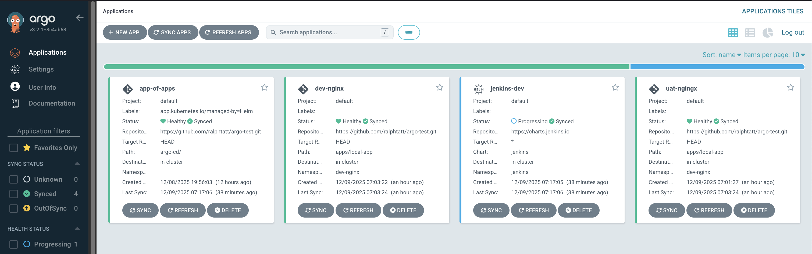

# ArgoCD "Chart of Charts"

## What is this repo?

This repo contains a configuration for helping understand and test ArgoCD, specifically the "Chart of Charts". It is relatively simple and contrived to be the barebones of ArgoCD, so does not reflect a real set up. However, it does still have utility in helping understand the basic structure of an ArgoCD deployment.

### Repo Structure

There is an example "app" in the `apps/local-app/` directory. This is to be an example of an application we may want to deploy that is in one of our git repos. In this example it is in the same repo as everything else, but it could in reality be in any git repository (for example one a development team owns).

There is the `argo-cd/` directory which contains a Helm chart with multiple ArgoCD "Application" manifests that reference one of our own applications (app-1 and app-2) and an external helm chart (jenkins).

Finally there is the `bootstrap/` directory which is the "App of Apps". This is ran once manually and is not tracked automatically by ArgoCD, hence the bootstrap name. It is the Application manifest for the `argo-cd/` helm chart and what allows us to automatically track the other charts and add them automatically.

These will end up appearing in ArgoCD like so:



## Deploying

### Prerequisites

the following prerequisites:

- A Kubernetes cluster (local: colima, kind, minikube, k3s; or hosted: EKS, GKE, AKS).
- Sufficient node resources for ArgoCD and test workloads; a small development cluster (2–4 CPU, 4–8GB RAM) is usually sufficient (although performance is not a major required to see ArgoCD working).
- Kubectl and Helm installed and usable from your workstation.
- Git with a copy of this repository so ArgoCD can track and you can push changes.
- The repository needs to be public (or you can set up the credentials for ArgoCD to gain access, but this is not covered at the moment).

### Setting up ArgoCD

Install [ArgoCD](https://argo-cd.readthedocs.io/en/stable/operator-manual/installation/) on the cluster:

```bash
helm repo add argo https://argoproj.github.io/argo-helm
helm repo update
helm upgrade --install argocd argo/argo-cd \
  --namespace argocd \
  --create-namespace
```

Now you can connect to the server:

```bash
# Open port forward to service
kubectl port-forward service/argocd-server -n argocd 8080:443

# Get admin password (username is just "admin")
kubectl -n argocd get secret argocd-initial-admin-secret -o jsonpath="{.data.password}" | base64 -d

```

### Applying Configuration

Now we can apply the ArgoCD configuration to our cluster.

Make sure to update repoURL, as this is where ArgoCD will be tracking for changes!

```bash
helm upgrade --install argo-cd-bootstrap bootstrap\
  --namespace argocd \
  --create-namespace \
  --set repoURL="https://git_host.com/account/repo.git"
```

> `targetRevision` can also be set to specifiy a certain branch/tag. By default this will follow the HEAD, as specified in the `bootstrap/values.yaml`.

This deploys an application for the apps defined in the `argo-cd` directory.  Any future additions or changes to this `argo-cd` directory are then updated in ArgoCD automatically.

The `argo-cd` application definition pass the environment variable to the applications defined in the `apps` directory, which then have a relevant `ENV.yaml` with the charts values for the environment. Updating these files will reflect in the relevant environment.

## Making Changes

Now if you were to make changes to the `app/` or `argo-cd/` directories, they should be automatically updated in ArgoCD. Even adding a new Application manifest. 

You could try adding one for Grafana, or a third copy of the `apps/local-app/` chart. Or deleteing one of them.
